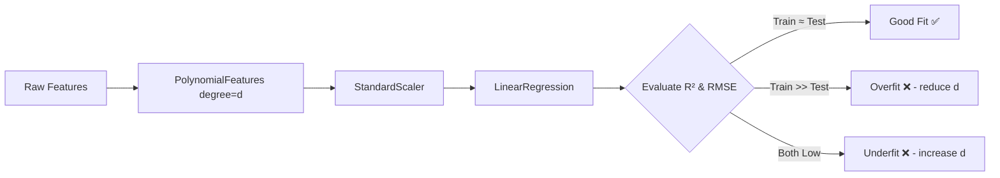
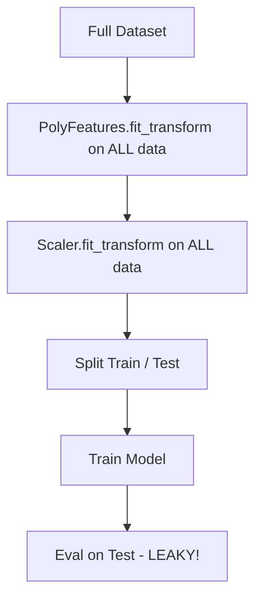
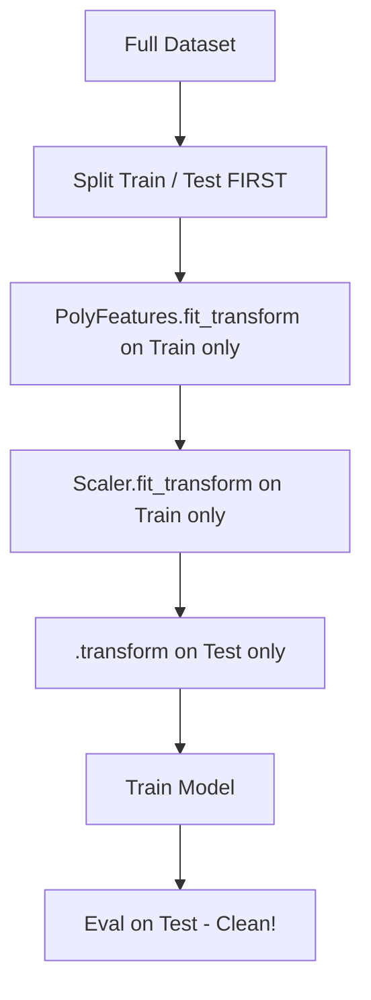
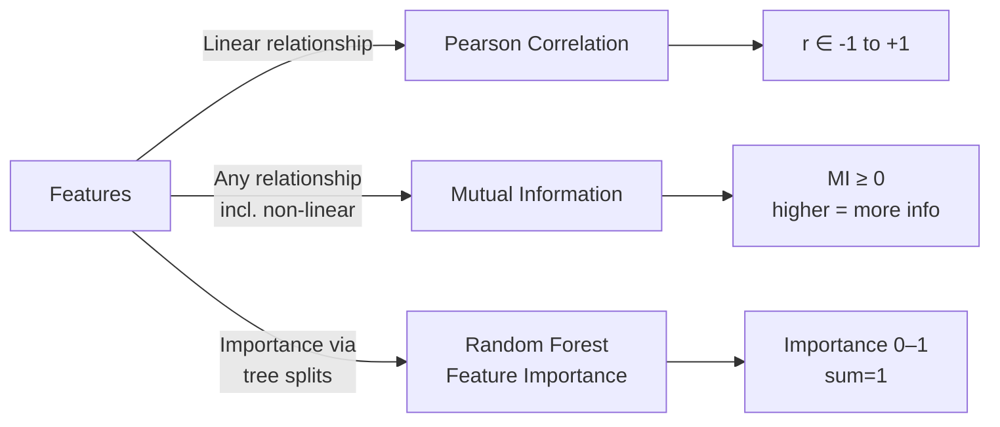
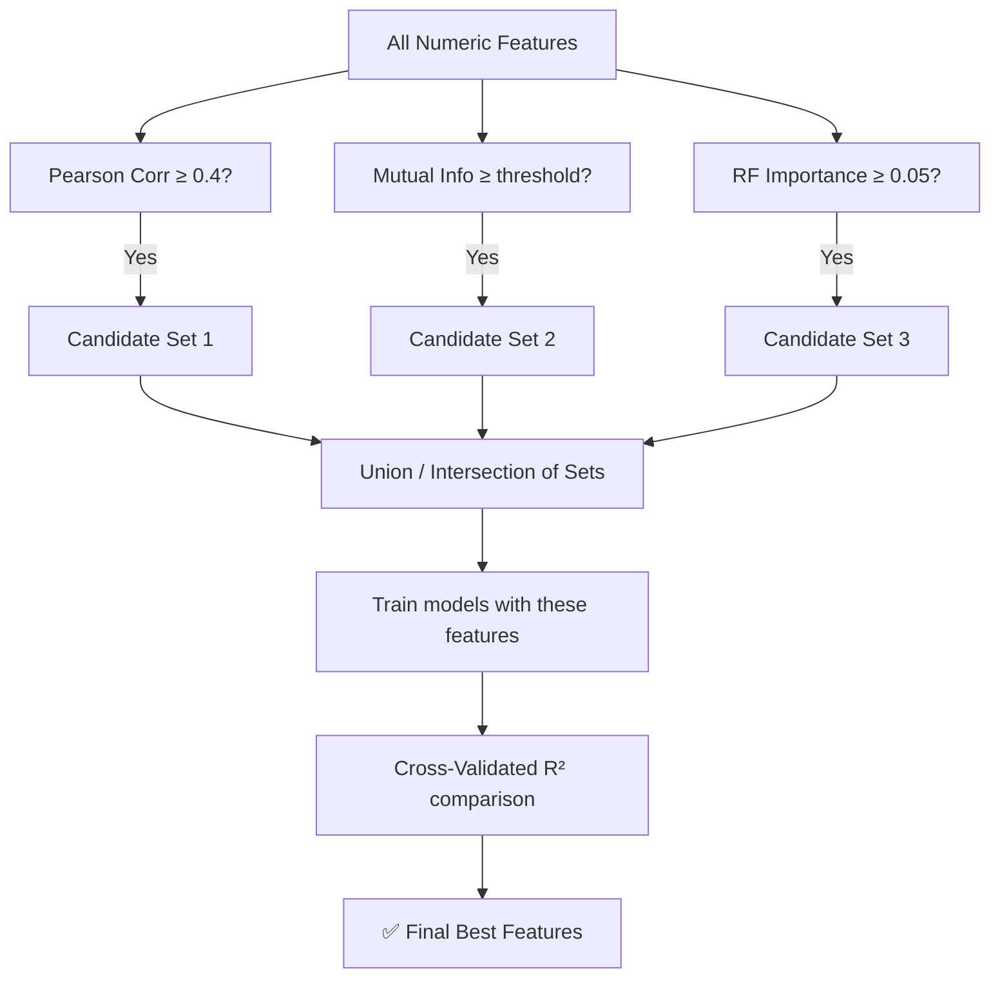
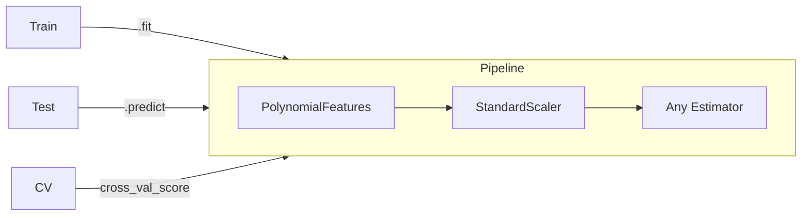
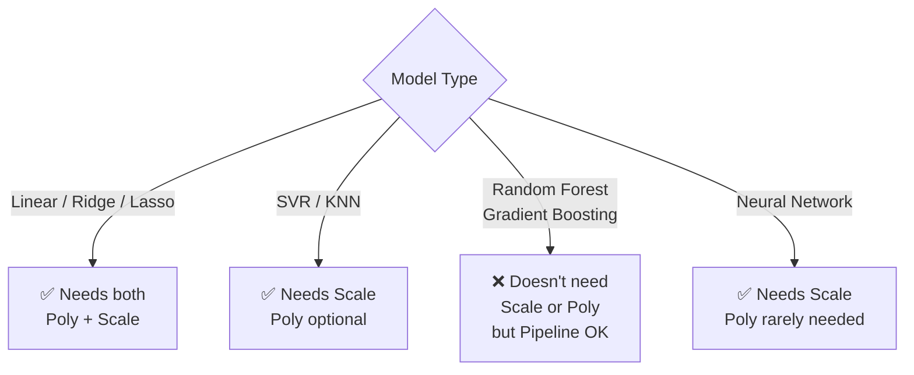
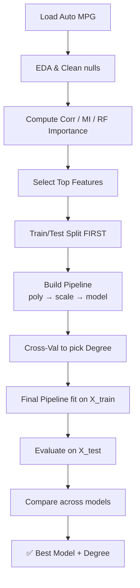

### Avoiding Data Leakage 

# Polynomial Regression – Auto MPG Dataset
### Complete Guide: Feature Selection, Data Leakage, Pipelines & Model Comparison

---

##  1. Dataset Setup

```python
import pandas as pd
import numpy as np
import matplotlib.pyplot as plt
import seaborn as sns
from sklearn.datasets import fetch_openml

# Load Auto MPG
mpg = fetch_openml(name='autoMPG', version=1, as_frame=True)
df = mpg.frame
df.dropna(inplace=True)

# Target = mpg, Features = horsepower, weight, displacement, acceleration, etc.
X = df.drop(columns=['mpg'])
y = df['mpg']
```

---

##  2. How to Find the Degree of Polynomial Regression

### Concept
The "right" degree balances **underfitting** (too simple) vs **overfitting** (too complex).



### Code: Cross-Validated Degree Search

```python
from sklearn.preprocessing import PolynomialFeatures, StandardScaler
from sklearn.linear_model import LinearRegression
from sklearn.pipeline import Pipeline
from sklearn.model_selection import cross_val_score, train_test_split

X_train, X_test, y_train, y_test = train_test_split(X[['horsepower','weight']], y, 
                                                      test_size=0.2, random_state=42)

train_scores, test_scores = [], []
degrees = range(1, 7)

for d in degrees:
    pipe = Pipeline([
        ('poly',  PolynomialFeatures(degree=d, include_bias=False)),
        ('scale', StandardScaler()),
        ('model', LinearRegression())
    ])
    cv_scores = cross_val_score(pipe, X_train, y_train, cv=5, scoring='r2')
    pipe.fit(X_train, y_train)
    train_scores.append(pipe.score(X_train, y_train))
    test_scores.append(cv_scores.mean())

# Plot
plt.figure(figsize=(8,4))
plt.plot(degrees, train_scores, 'o-', label='Train R²')
plt.plot(degrees, test_scores,  's--', label='CV R²')
plt.xlabel('Polynomial Degree')
plt.ylabel('R² Score')
plt.title('Degree Selection – Bias-Variance Tradeoff')
plt.legend(); plt.grid(True); plt.tight_layout(); plt.show()
```

### Decision Rule

| Degree | Train R² | CV R²  | Diagnosis       |
|--------|----------|--------|-----------------|
| 1      | 0.71     | 0.69   | Underfit        |
| **2**  | **0.83** | **0.81**| **✅ Best**    |
| 3      | 0.89     | 0.78   | Starting to overfit |
| 4+     | 0.97     | 0.61   | Overfit         |

> **Rule of Thumb:** Pick the degree where CV R² is highest and Train−CV gap is smallest.

---

##  3. Data Leakage: `fit_transform` on Test Data

### What is Leakage?

> **Leakage** = when information from the **test set bleeds into training**, giving falsely optimistic scores.

<table>
<tr>
<th>❌ WRONG — Leaky</th>
<th>✅ CORRECT — Clean</th>
</tr>
<tr>
<td>
    


</td>
<td>
    


</td>
</tr>
</table>  

### Why It Happens

```python
# ❌ WRONG – leakage! Scaler sees test stats during fit
poly = PolynomialFeatures(degree=2)
X_poly = poly.fit_transform(X)          # uses ALL data
scaler = StandardScaler()
X_scaled = scaler.fit_transform(X_poly) # uses ALL data
X_train, X_test = train_test_split(X_scaled, ...)

# ✅ CORRECT – no leakage
X_train, X_test, y_train, y_test = train_test_split(X, y, test_size=0.2)
poly = PolynomialFeatures(degree=2)
X_train_poly = poly.fit_transform(X_train)   # fit ON TRAIN
X_test_poly  = poly.transform(X_test)        # only transform TEST

scaler = StandardScaler()
X_train_sc = scaler.fit_transform(X_train_poly)  # fit ON TRAIN
X_test_sc  = scaler.transform(X_test_poly)       # only transform TEST
```

### The Elegant Fix: **Pipeline** (auto-prevents leakage)

```python
pipe = Pipeline([
    ('poly',  PolynomialFeatures(degree=2, include_bias=False)),
    ('scale', StandardScaler()),
    ('model', LinearRegression())
])

pipe.fit(X_train, y_train)      # fit only on train
pipe.score(X_test, y_test)      # transforms test correctly inside pipeline
```

> ✅ Pipeline ensures `fit_transform` only ever runs on **training folds**, and `transform` runs on validation/test folds — even inside `cross_val_score`.

---

##  4. Feature Relationship Methods: corr vs MI vs Random Forest

### The Big Picture



### 4a. Pearson Correlation

```python
corr = df.corr(numeric_only=True)['mpg'].drop('mpg').sort_values()

plt.figure(figsize=(7,4))
corr.plot(kind='barh', color=corr.map(lambda x: 'steelblue' if x>0 else 'tomato'))
plt.title('Pearson Correlation with MPG')
plt.axvline(0, color='black', lw=0.8)
plt.tight_layout(); plt.show()
```

**What it detects:** Only **linear** relationships  
**Blind to:** Curves, interactions, non-monotonic patterns

### 4b. Mutual Information (MI)

```python
from sklearn.feature_selection import mutual_info_regression

X_num = df.select_dtypes(include=np.number).drop(columns=['mpg'])
mi = mutual_info_regression(X_num, y, random_state=42)
mi_series = pd.Series(mi, index=X_num.columns).sort_values(ascending=False)

mi_series.plot(kind='bar', figsize=(7,4), color='mediumseagreen')
plt.title('Mutual Information with MPG')
plt.ylabel('MI Score'); plt.tight_layout(); plt.show()
```

**What it detects:** **Any** statistical dependency (linear + non-linear)  
**How:** Estimates entropy reduction — how much knowing X reduces uncertainty in y

### 4c. Random Forest Feature Importance

```python
from sklearn.ensemble import RandomForestRegressor

rf = RandomForestRegressor(n_estimators=200, random_state=42)
rf.fit(X_num, y)
imp = pd.Series(rf.feature_importances_, index=X_num.columns).sort_values(ascending=False)

imp.plot(kind='bar', figsize=(7,4), color='darkorange')
plt.title('Random Forest Feature Importance for MPG')
plt.ylabel('Importance'); plt.tight_layout(); plt.show()
```

**What it detects:** Importance based on how much each feature **reduces impurity** across all splits  
**Bonus:** Handles interactions between features automatically

### Comparison Table

| Method               | Captures Linear | Captures Non-linear | Handles Interactions | Scale Sensitive | Speed  |
|----------------------|:--------------:|:-------------------:|:--------------------:|:---------------:|--------|
| Pearson Correlation  | ✅              | ❌                  | ❌                   | No              | Fast   |
| Mutual Information   | ✅              | ✅                  | Partial              | No              | Medium |
| Random Forest Imp.   | ✅              | ✅                  | ✅                   | No              | Slow   |

---

##  5. How Best Features Are Selected

### Full Feature Selection Pipeline



### Code: Side-by-Side Ranking

```python
import pandas as pd

# Combine all three rankings
feature_df = pd.DataFrame({
    'Correlation': corr.abs(),
    'Mutual_Info': mi_series,
    'RF_Importance': imp
}).fillna(0)

# Rank each (1 = most important)
for col in feature_df.columns:
    feature_df[col+'_rank'] = feature_df[col].rank(ascending=False)

feature_df['avg_rank'] = feature_df[['Correlation_rank',
                                       'Mutual_Info_rank',
                                       'RF_Importance_rank']].mean(axis=1)

best_features = feature_df.sort_values('avg_rank').index[:4].tolist()
print("Best Features:", best_features)
```

### Typical Result for Auto MPG

| Feature        | Corr (abs) | MI Score | RF Importance | Avg Rank |
|----------------|-----------|----------|---------------|----------|
| weight         | 0.83      | 0.72     | 0.35          | 1.0 ✅   |
| displacement   | 0.80      | 0.68     | 0.28          | 2.0 ✅   |
| horsepower     | 0.78      | 0.65     | 0.22          | 3.0 ✅   |
| cylinders      | 0.78      | 0.60     | 0.10          | 4.0      |
| acceleration   | 0.42      | 0.30     | 0.05          | 6.0 ❌   |
| model_year     | 0.58      | 0.50     | 0.08          | 5.0      |

---

##  6. Pipelines: Poly + Scale + Model Across Different Models

### Why Pipeline?



> The **same** preprocessing steps wrap **any** model — swap just the last step.

### Code: Comparing 4 Models with Same Pipeline

```python
from sklearn.linear_model import LinearRegression, Ridge, Lasso
from sklearn.ensemble import RandomForestRegressor
from sklearn.svm import SVR
from sklearn.model_selection import cross_val_score
import warnings; warnings.filterwarnings('ignore')

best_features = ['weight', 'displacement', 'horsepower']
X_sel = df[best_features]
X_tr, X_te, y_tr, y_te = train_test_split(X_sel, y, test_size=0.2, random_state=42)

# ── Models to compare ──────────────────────────────────────────────
models = {
    'Linear Regression':    LinearRegression(),
    'Ridge (α=1)':          Ridge(alpha=1),
    'Lasso (α=0.1)':        Lasso(alpha=0.1),
    'Random Forest':        RandomForestRegressor(n_estimators=100, random_state=42),
}

results = {}

for name, estimator in models.items():
    # Poly + Scale only for linear models; RF doesn't need them but won't hurt
    pipe = Pipeline([
        ('poly',  PolynomialFeatures(degree=2, include_bias=False)),
        ('scale', StandardScaler()),
        ('model', estimator)
    ])
    cv = cross_val_score(pipe, X_tr, y_tr, cv=5, scoring='r2')
    pipe.fit(X_tr, y_tr)
    test_r2 = pipe.score(X_te, y_te)
    results[name] = {'CV R² Mean': cv.mean().round(3),
                     'CV R² Std':  cv.std().round(3),
                     'Test R²':    test_r2.round(3)}

results_df = pd.DataFrame(results).T
print(results_df)

# Bar chart comparison
results_df[['CV R² Mean','Test R²']].plot(kind='bar', figsize=(9,4),
    color=['steelblue','darkorange'], edgecolor='white')
plt.title('Model Comparison – Polynomial Features (degree=2)')
plt.ylabel('R² Score'); plt.xticks(rotation=15); plt.ylim(0.5, 1.0)
plt.legend(); plt.grid(axis='y'); plt.tight_layout(); plt.show()
```

### Does Poly/Scale Help All Models?



| Model                  | Needs PolyFeatures | Needs Scaling | Notes                                   |
|------------------------|--------------------|---------------|-----------------------------------------|
| Linear Regression      | ✅ Often           | ✅ Yes        | Poly adds non-linearity                 |
| Ridge / Lasso          | ✅ Often           | ✅ Yes        | Scale critical for regularization       |
| SVR                    | Optional           | ✅ Yes        | SVR very sensitive to scale             |
| KNN                    | Optional           | ✅ Yes        | Distance-based, scale mandatory         |
| Random Forest          | ❌ No              | ❌ No         | Tree splits are scale/feature invariant |
| Gradient Boosting (XGB)| ❌ No              | ❌ No         | Same as RF                              |

---

##  7. Full End-to-End Workflow



```python
# ── Complete clean script ──────────────────────────────────────────
from sklearn.pipeline import Pipeline
from sklearn.preprocessing import PolynomialFeatures, StandardScaler
from sklearn.linear_model import Ridge
from sklearn.model_selection import GridSearchCV, train_test_split

X_tr, X_te, y_tr, y_te = train_test_split(
    df[['weight','displacement','horsepower']], df['mpg'],
    test_size=0.2, random_state=42)

pipe = Pipeline([
    ('poly',  PolynomialFeatures(include_bias=False)),
    ('scale', StandardScaler()),
    ('model', Ridge())
])

param_grid = {
    'poly__degree': [1, 2, 3],
    'model__alpha':  [0.1, 1, 10, 100]
}

gs = GridSearchCV(pipe, param_grid, cv=5, scoring='r2', n_jobs=-1)
gs.fit(X_tr, y_tr)

print("Best Params:", gs.best_params_)
print("Best CV R²:", gs.best_score_.round(3))
print("Test R²:   ", gs.score(X_te, y_te).round(3))
```

---

##  Key Takeaways

> 1. **Degree selection** = find where CV R² peaks before overfitting gap widens
> 2. **Data leakage** = always split FIRST, then fit_transform on train only → use **Pipeline**
> 3. **Corr** = fast, linear only; **MI** = any relationship; **RF Importance** = interactions too
> 4. **Best features** = rank with all 3 methods, pick top consensus features
> 5. **Pipeline** wraps any model safely — but Poly/Scale are only *needed* for linear/distance-based models

---
*Generated for Auto MPG Polynomial Regression Study | Paste directly into Jupyter Notebook*


## Split first, then Scale

# Correct Approach

## Split First, Then Scale

```python
from sklearn.model_selection import train_test_split
from sklearn.preprocessing import StandardScaler, normalize

data_matrix = raw_data.values

# Exclude 'Time' (col 0), use features V1-V28 + Amount (col 1-29)
X = data_matrix[:, 1:30]
y = data_matrix[:, 30]

# Split BEFORE scaling
X_train, X_test, y_train, y_test = train_test_split( X, y, test_size=0.2, random_state=42, stratify=y
)

# Fit ONLY on training data, transform both
scaler = StandardScaler()
X_train = scaler.fit_transform(X_train)  # fit + transform on train
X_test  = scaler.transform(X_test)       # transform only on test

# Normalize AFTER scaling
X_train = normalize(X_train, norm="l1")
X_test  = normalize(X_test,  norm="l1")


## Using Pipeline for Cleaner code
```python
from sklearn.pipeline import Pipeline
from sklearn.preprocessing import StandardScaler, Normalizer
from sklearn.model_selection import train_test_split
from sklearn.svm import SVC

data_matrix = raw_data.values
X = data_matrix[:, 1:30]
y = data_matrix[:, 30]

# Split first
X_train, X_test, y_train, y_test = train_test_split(    X, y, test_size=0.2, random_state=101, stratify=y)

# Build Pipeline
pipeline = Pipeline([
    ('scaler',     StandardScaler()),        # Step 1: Standardize
    ('normalizer', Normalizer(norm='l1')),   # Step 2: Normalize
    ('svm',        SVC(kernel='rbf'))        # Step 3: Model
])

# Fit on train only — Pipeline handles fit vs transform automatically
pipeline.fit(X_train, y_train)

# Test data goes through same transforms (no leakage)
y_pred = pipeline.predict(X_test)


pipeline.predict(X_test)
        │
        ▼
┌─────────────────────┐
│  StandardScaler     │  → .transform(X_test)   ✅
│  (transform only)   │
└─────────────────────┘
        │
        ▼
┌─────────────────────┐
│  Normalizer(l1)     │  → .transform(X_test)   ✅
│  (transform only)   │
└─────────────────────┘
        │
        ▼
┌─────────────────────┐
│  SVC                │  → .predict(X_test)     ✅
└─────────────────────┘


| Method Called              | StandardScaler  | Normalizer      | SVM       |
|---------------------------|-----------------|-----------------|-----------|
| `pipeline.fit(X_train)`   | `fit_transform` | `fit_transform` | `fit`     |
| `pipeline.predict(X_test)`| `transform`     | `transform`     | `predict` |

# These two are equivalent:

```python
# Manual way
X_test_scaled     = scaler.transform(X_test)
X_test_normalized = normalizer.transform(X_test_scaled)
y_pred_manual     = svm.predict(X_test_normalized)

# Pipeline way (same result)
y_pred_pipeline = pipeline.predict(X_test)

# Should print True
print(np.array_equal(y_pred_manual, y_pred_pipeline))

## Takeways
- split before scaling to avoid data leakage.

- Pipelines automatically handle the correct sequence of fit and transform for both training and test sets.

- No need to manually normalize X_test — the pipeline applies the same transformations consistently.


```python

```
